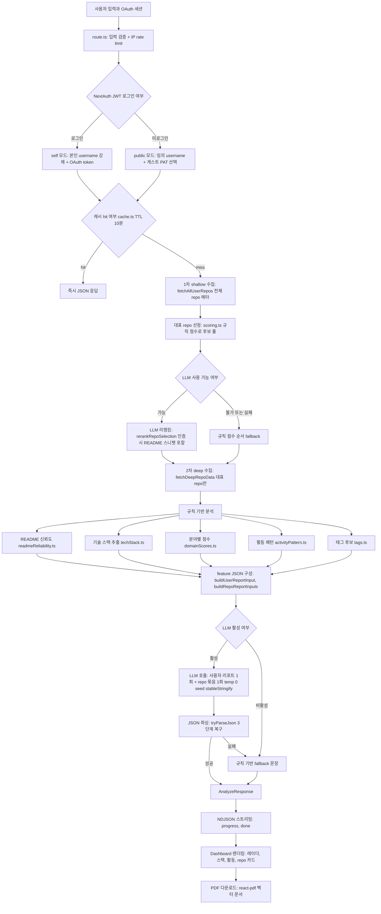

# GitHub 개발 활동 보고서 생성 서비스

## 한 줄 소개

GitHub 으로 로그인한 본인의 저장소(원하면 private 포함)를 분석해 **개발자 활동 요약, 기술 스택 분포, 대표 프로젝트 설명, 포트폴리오 문장, 이력서 bullet, 예상 면접 질문**을 생성하는 Gen AI 기반 리포트 서비스입니다. (로그인하지 않으면 임의 username 의 공개 저장소를 테스트용으로 분석할 수 있습니다.)

## 문제 정의

GitHub에는 개발 활동 정보가 풍부하지만, 그 자체가 곧바로 포트폴리오가 되지는 않습니다. 저장소, README, commit, 기술 스택이 분리되어 있어 정보를 구조화하기 어렵고, 해석 및 문장화 경험이 적은 취업 준비생이나 학생 개발자는 이를 포트폴리오나 이력서 언어로 정리하는 것에도 어려움을 겪습니다. 특히 README가 없거나 부실한 경우 기존 LLM 등을 활용한 단순 요약 방식은 잘못된 결과를 만들 수 있습니다.

## 해결 방법

본 서비스는 README를 그대로 요약하지 않고, **repository 구조 / 설정 파일 / commit history / 기술 스택 정보를 함께 규칙 기반으로 분석**한 뒤, 그 결과를 LLM 에 **요약된 feature 형태로만** 전달하여 사용자 수준 리포트와 repo 별 산출물을 생성합니다.

- README 신뢰도를 평가하고 부족한 부분은 구조 / commit 으로 보완
- 전체 코드를 LLM 에 넣지 않고 요약 feature 만 전달해 비용과 hallucination 위험을 줄임
- 결과는 단정 표현 대신 "공개 저장소 기준 추정 / 경향" 으로 표현

### 핵심 차별점

1. **README를 그대로 믿지 않고 신뢰도를 평가합니다.** high / medium / low / missing 4단계로 분류하고, 구조 / commit 과의 일관성으로 교차 검증합니다.
2. **구조와 commit을 함께 분석해 README 부족 문제를 보완합니다.** 설정 파일, 디렉토리 구조, 최근 commit 메시지가 README 부재를 대체합니다.
3. **LLM에 전체 코드를 넣지 않습니다.** 규칙 기반 분석으로 정리한 요약 feature(JSON)만 전달해 호출 비용을 줄이고 할루시네이션 위험을 낮춥니다.
4. **단순 통계가 아니라 커리어 산출물까지 생성합니다.** 한 줄 요약 / 분야별 점수 / 포트폴리오 문장 / 이력서 bullet / 면접 질문이 한 번에 나옵니다.
5. **웹 대시보드 + PDF 결과물로 산출물을 생성합니다.** 별도 PDF 서버 없이 클라이언트에서 `@react-pdf/renderer` 로 레이더 / 막대 / 도넛 차트와 대표 저장소 카드까지 포함한 벡터 PDF를 생성해 다운로드합니다.
6. **의존성 목록만 보지 않고 핵심 기술 자산을 짚습니다.** 정제한 재귀 파일 트리(`lib/llm.ts` 같은 파일명 자체가 신호)와 `.env.example` 변수명(`OPENAI_API_KEY`, `DATABASE_URL` 등)을 LLM 입력에 더해, package.json 의존성만으로는 안 잡히던 LLM API 연동 / OAuth 인증 / DB 연동 같은 자산을 우선 식별합니다.

---

## 시스템 아키텍처



### 단계별 요약

| 단계 | 담당 파일 / 함수 | 처리 내용 | 출력 |
| --- | --- | --- | --- |
| 세션 / 모드 결정 | `route.ts` (`getToken`) | 로그인이면 self(본인 username 강제), 미로그인이면 public | mode / username / includePrivate |
| 검증 / 한도 | `route.ts` (`enforceRateLimit`) | IP 당 1분 20회, username 정규식 검증 | 통과 / 400 / 429 |
| 캐시 | `cache.ts` | TTL 10분, 키에 mode / private / timezone / LLM tag 포함 | hit 시 즉시 응답 |
| 1차 shallow | `github.ts: fetchAllUserRepos` | 전체 repo 메타데이터 (최대 10페이지, 1000개) | `GitHubRepo[]` |
| 대표 선정 | `scoring.ts` + `analyze.ts` | 규칙 점수로 상위 K개 후보 풀 구성 | 후보 풀 |
| LLM 리랭킹 | `llm.ts: rerankRepoSelection` | 포트폴리오 관점으로 N개 선정 (실패 시 규칙 fallback) | 대표 repo |
| 2차 deep | `github.ts: fetchDeepRepoData` | README / 재귀 파일 경로 / 언어 / commit / 설정 / env 변수명 | `DeepRepoData` |
| 규칙 분석 | `readmeReliability` / `techStack` / `domainScores` / `activityPattern` / `tags` | 신뢰도 / 스택 / 6축 점수 / 활동 / 태그 | 분석 결과 |
| LLM 생성 | `llm.ts: generateUserReport / generateRepoReports` | 요약 / 포트폴리오 / 이력서 / 면접 질문 | LLM 리포트 |
| 출력 | `route.ts` 스트림 → `Dashboard` → `PdfReportDocument` | NDJSON 스트리밍 → 대시보드 → PDF | 화면 / 파일 |

---

## 주요 기능

- **GitHub OAuth 로그인** (NextAuth + `next-auth/providers/github`) — 로그인하면 본인의 private repo 까지 분석 가능
- **게스트 모드** — 비로그인 상태에서도 임의 username의 공개 repo를 가볍게 체험 분석 가능함. 게스트가 사이드바에 본인 GitHub PAT를 입력하면 인증 호출로 GitHub rate limit을 완화할 수 있음
- GitHub repository 수집 (1차 shallow + 2차 deep)
- 활동 분석은 사용자의 **전체 저장소** 를 대상으로 진행 (shallow 수집 + 언어 기반 도메인 신호)
- 그 중 **대표 repo를 자동 선정**해 카드 형태로 표시 (사이드바 슬라이더로 개수 조절 가능. self 모드 또는 게스트 PAT 입력 시 최대 5개, 미인증 게스트는 최대 3개로 제한)
- README 신뢰도 평가 (high / medium / low / missing)
- 구조 / commit 기반 프로젝트 분석
- 기술 스택 추출 — 언어(byte 비중)는 전부 노출하고, 설정 파일 / 디렉토리 / DB 드라이버 / `.env` 예시 변수명 기반으로 프레임워크 / DB 엔진 / 도구를 추론해 범주별로 묶어 표시
- 분야별 점수 계산 (Frontend / Backend / Data·ML / Mobile / DevOps / Collaboration, 0-100 정규화)
- 활동 패턴 분석 (사용자가 선택한 타임존 기준 야간 / 오전 / 오후 / 주말 비율, 일관성, 태그. 기본값은 브라우저 감지 타임존)
- LLM 기반 사용자 한 줄 요약 + 종합 요약
- repo 별 포트폴리오 문장 / 이력서 bullet / 예상 면접 질문 생성
- LLM 생성 문장(요약 / 포트폴리오 문장 / 이력서 bullet)에 **복사 버튼** 제공, 리포트 상단에 "AI 초안 · 검토 필요" 안내.
- 분석 진행 상태를 서버가 **NDJSON 스트리밍**으로 실시간 push -> 로딩 UI 단계가 실제 파이프라인 단계와 일치
- SVG 6축 레이더 차트, 기술 스택 분포 막대, 활동 패턴 패널
- README / 분석 신뢰도 badge, 경고 박스
- PDF 다운로드 — `@react-pdf/renderer` 로 클라이언트에서 벡터 PDF 문서를 직접 생성 (레이더 / 막대 / 도넛 차트까지 SVG로 그려넣고 한글 폰트 임베드함, 별도 PDF 서버 불필요)
- in-memory TTL 캐시 (10분) — 동일 입력 재분석 시 GitHub API 호출 비용 절감

## 로그인 상태별 동작 차이

모드는 별도 토글이 아니라 **로그인 여부로 자동 결정**됩니다. 같은 분석 파이프라인을 쓰지만, 인증 수단에 따라 분석 범위 / 호출 한도 / 정확도 보강 상태가 달라집니다.

| 항목 | 게스트 (토큰 없음) | 게스트 (PAT 입력) | 로그인 (GitHub OAuth) |
| --- | --- | --- | --- |
| 모드 | public | public | self (본인 계정, 서버가 username 강제) |
| 분석 대상 | 임의 username 의 공개 repo | 임의 username 의 공개 repo | 본인 계정 repo |
| private repo | 불가 | 불가 (공개 repo만) | 동의(`includePrivate`) 시 분석 |
| GitHub 인증 | 미인증 호출 | 사용자 PAT로 인증 호출 | OAuth access token으로 인증 호출 |
| GitHub rate limit | 시간당 60회 | 시간당 5,000회 | 시간당 5,000회 |
| 대표 repo 최대 개수 | 3 | 5 | 5 |
| README 스니펫 peek | 비활성 | 활성 | 활성 |
| 토큰 취급 | — | 메모리에만 보관, 캐시 키엔 fingerprint(해시 앞부분)만 포함 | 서버 라우트에서 `getToken()` 으로만 접근, 클라이언트 비노출 |

보충 설명:

- **README 스니펫 peek**: 대표 repo 선정 시 후보의 README 앞부분(약 500자)을 LLM 에 함께 보내 정확도를 높이는 기능입니다. 추가 GitHub 호출이 들기 때문에 **인증 호출일 때만** 켭니다. 따라서 게스트(토큰 없음) 상태라도 서버에 `GITHUB_TOKEN`이 설정돼 있으면 그 토큰으로 인증 호출이 되어 rate limit 5,000회 + peek 활성으로 동작합니다.
- **게스트 PAT**: 새로고침하면 사라지는 메모리 보관값이며, 응답 / 로그 / 캐시 키 어디에도 원문 토큰이 들어가지 않습니다. PAT 는 호출 한도 완화 용도이고, public 모드에서는 어차피 공개 repo 만 조회합니다.
- **로그인(self) 모드**: 서버가 OAuth 토큰의 실제 사용자명과 요청 username을 대조해, 남의 GitHub를 상세 분석할 수 없도록 접근 시도를 차단합니다(불일치 시 403).

---

## 대표 repo 선정 기준

전체 저장소에 규칙 기반 점수를 매겨 후보를 추리고, (LLM 사용 시) 포트폴리오 관점으로 리랭킹해 최종 대표 repo 를 고릅니다.

**1. 규칙 점수 (`scoring.ts: computeShallowScore` → deep 수집 후 `refineScoreWithDeepData`, 0-100)**

"이력서 대표성" 관점에서 **실속(구조 / README) 우선**으로 가중치를 둡니다.

| 신호 | 점수 | 설명 |
| --- | --- | --- |
| 구조 (파일 / 폴더) | +20 | deep 수집 후. 루트 엔트리 3개 이상이면 만점, 1-2개 부분 점수 |
| README | +15 | deep 수집 후. README 존재 시 |
| 최근성 | +15 | `updated_at` / `pushed_at` 중 **더 최근 값** 기준, 1년 이상 활동 없으면 0 |
| 배포 (homepage / Pages) | +10 | 실제 배포 URL 이 있으면 가산 (포트폴리오 강신호) |
| description | 0-10 | 설명 길이에 비례한 연속 점수, 없으면 0 |
| 활동성 (star / fork) | 0-8 | log scale. 학생 / 취준생 repo 는 변별력이 낮아 보조 신호로만 |
| topics | +5 | 분류 / 관리 의지 신호 |
| archived / disabled | -25 | 보관 / 비활성(죽은) repo 강등 (완전 제외는 아님) |
| fork | -5 또는 -10 | description 유무로 차등 (본인 작성 설명이 있으면 완화) |
| 튜토리얼 / 클론 패턴 | -15 | 이름 / 설명이 학습용(`tutorial`, `clone`, `boilerplate` 등) |
| 빈 repo (size) | -10 또는 -20 | 사실상 비어 있는 repo |

**2. 후보 풀 구성 (`analyze.ts`)** — 규칙 점수 상위 K개(보통 12개 내외)를 후보 풀로 사용합니다. 별도 다양성 알고리즘은 두지 않고, "여러 언어 / 도메인을 고르게 보여주기"는 아래 LLM 리랭킹 단계에 맡깁니다.

**3. (선택) LLM 리랭킹 (`llm.ts: rerankRepoSelection`)** — 후보의 **메타데이터**(이름 / 설명 / 언어 / topics / 별점 / 사이즈 / recency / 배포 URL / 보관 여부)에 더해, **인증된 호출일 때는 각 후보의 README 앞부분 스니펫(약 500자)** 을 함께 보내 포트폴리오 관점에서 N개를 선정합니다. 전체 코드 본문은 보내지 않아 토큰 비용 / 할루시네이션 / private 노출을 억제하고, 미인증 호출에서는 rate limit 부담을 피하려 스니펫 없이 메타데이터만 사용합니다. LLM 이 고른 이름은 실제 후보 목록에 존재하는 것만 통과시키며(할루시네이션 차단), LLM 실패 시 규칙 점수 순서로 자동 fallback 합니다.

## 기술 스택 추출 기준

기술 스택 표시는 성격이 다른 두 가지를 **분리**합니다 (`techStack.ts`).

**1. 언어 (GitHub languages API의 byte 비중)**

GitHub languages API 의 **byte 비중**을 그대로 사용하며, 임계값 없이 들어간 언어를 전부 비중(%)과 함께 표시합니다. (예: `TypeScript 84% · CSS 9% · PLpgSQL 4%`) byte 분포를 가져오지 못하면 주 언어만 100%로 폴백합니다.

**2. 추론한 기술 스택 (코드 / 설정 기반으로 알아내는 부분)**

여러 신호에 가중치(weight)를 매겨 누적한 뒤, **합산 weight 2 이상인 항목 상위 12개**만 채택합니다. 표시할 때는 순수 언어 항목을 빼고(위 1번과 중복 방지) 범주별로 묶습니다.

| 신호 출처 | 추출 대상 | weight |
| --- | --- | --- |
| `package.json` 의존성 | 프레임워크 / 라이브러리(Next.js · React · NestJS 등), DB 드라이버(`pg` · `mongodb` · `ioredis` · `drizzle-orm` 등) | 3-4 |
| `requirements.txt` / `pyproject.toml` | Django · FastAPI · PyTorch · Transformers · LangChain, DB 드라이버(`psycopg2` · `pymongo` 등) | 3 |
| `build.gradle` / `pom.xml`, `pubspec.yaml`, `Dockerfile` | Spring · Kotlin · Flutter · Docker | 2-4 |
| 언어 byte 비중 | 50% 이상 → 3, 10% 이상 → 2, 그 미만 → 1 (잡음 언어 자동 탈락) | 1-3 |
| 디렉토리 구조 | `.github` → GitHub Actions, `.ipynb` → Jupyter, `android` / `ios` → Mobile Native | 2 |
| `.env` 예시 변수명 | `POSTGRES*` / `NEON` / `SUPABASE` → PostgreSQL, `MONGO` → MongoDB, `REDIS` → Redis 등 DB / 캐시 엔진 추정(값은 안 봄) | 2 |
| repo topics | 사용자가 단 토픽 그대로 | 1 |

표시 범주: `언어 · 프론트엔드 · 백엔드 · 데이터·ML · 데이터베이스 · 모바일 · 테스트 · 인프라·도구 · 기타`. 매핑에 없는 언어는 `언어`, 미지의 값은 `기타` 로 분류합니다.

## 활동 패턴 / 뱃지 기준

대표 repo의 commit author timestamp를 사용자가 고른 타임존으로 환산해 계산합니다(`activityPattern.ts`, 기본 `Asia/Seoul`, Intl 기반 DST 반영). 표본이 부족하면 `commit 표본 부족`만 답니다.

- **시간대 구간**: 야간 21-03시 / 오전 05-11시 / 오후·저녁 12-20시
- **일관성(consistency)**: commit이 특정 기간에 몰리지 않고 여러 날짜 / 주에 고르게 분포하는지를 0-1 로 나타낸 지표 (최근 12주 관측창 + 표본 수 보정)

시스템이 다는 활동 뱃지와 조건:

| 뱃지 | 조건 |
| --- | --- |
| 야간 활동 경향 | 야간 비율 0.4 이상 |
| 오전 활동 경향 | 오전 비율 0.4 이상 |
| 오후 / 저녁 활동 경향 | 오후 비율 0.4 이상 |
| 시간대 고르게 분포 | 위 세 구간 중 두드러진 곳이 없을 때 |
| 주말 집중형 | 주말 비율 0.35 이상 |
| 주중 집중형 | 주말 비율 0.1 이하 |
| 꾸준한 커밋형 | 일관성 0.5 이상 |
| 단기 몰입형 | 일관성이 0 초과 0.2 미만 |
| 최근 활동 활발 | 최근 활동(30일 이내) 있음 |
| commit 표본 부족 | 표본이 통계 판단에 부족할 때(5개 미만) |

---

## LLM 제어 설계

먼저 규칙 기반 분석으로 GitHub 데이터를 정리한 뒤(README 신뢰도 등급, 기술 스택 후보 + 가중치, 정제한 재귀 파일 경로, `.env` 예시 변수명, 분야별 점수, 활동 패턴, 추론 메모), 그 정리된 결과(JSON)만 LLM에 전달합니다. 즉 **Gen AI는 "데이터 수집" 이 아니라 "해석된 결과를 커리어 언어로 변환하는 단계"** 에 사용됩니다.

### LLM 입력 (feature JSON)

LLM에는 raw code가 아니라 요약 feature만 들어갑니다.

- 사용자 리포트 입력: username / scope / repo 수 / top 언어 / 도메인 점수 / 활동 비율 / 태그 후보 / 대표 repo 요약
- repo 리포트 입력: repo_name / description / readme_reliability(레벨만) / languages(상위 5) / tech_stack / structure_summary(8) / file_tree(정제 경로 40) / env_keys(변수명 25) / recent_commits(의미 있는 6개) / inference_notes
- **제외하는 정보**: 코드 본문 전체, README 전문(repo 리포트엔 신뢰도 레벨만 전달), `.env` 실제 값, 토큰 / API 키

### 재현성 (determinism)

같은 사용자에 대해 여러 번 분석해도 비슷한 어휘 / 문장이 나오도록 다음 장치를 적용했습니다.

- **샘플링 파라미터를 greedy 에 가깝게 고정**: `temperature=0`, `seed=<payload 해시>`.
  - 결정성에 필요한 파라미터만 보냄: `top_p` / `frequency_penalty` / `presence_penalty` 는 (1) temperature=0이면 효과가 없고, (2) Claude 등 일부 모델이 거절(400)하므로 일부러 보내지 않음(기본값 0으로 동작).
- **입력 페이로드 stable serialization**: 객체 key를 알파벳 순으로 정렬해 직렬화하므로 같은 입력은 항상 같은 문자열이 모델로 들어감 (`stableStringify`).
- **결정적 seed 계산**: (프롬프트 버전 + 모델 ID + 정렬된 payload)의 32-bit 해시를 OpenAI 호환 `seed` 파라미터로 전달. 프롬프트 본문이나 호출 파라미터 형태가 바뀌면 `PROMPT_VERSION` 도 함께 올려 seed가 자동 무효화됨.
- **프롬프트 자유도 축소**: headline / portfolio_sentence / resume_bullet 의 종결 어휘를 화이트리스트로 제한, 길이 / 항목 수를 정수로 고정, 1개의 few-shot 예시로 톤 및 구조 잠금.

> 게이트웨이 뒤 모델이 GPT 계열이면 `seed` 가 그대로 반영되어 사실상 byte 단위에 가까운 재현이 가능합니다. Claude / Gemini 계열은 `seed` 를 무시할 수 있지만, `temperature=0` 만으로도 그리디 디코딩에 가까워 어휘 / 문장 구조의 큰 변동은 사라집니다. (Gemini는 `seed` 필드를 거절하므로 모델 패턴으로 미리 빼서 호출하고, 400 응답 시 한 번 더 재시도합니다.)

### JSON 강제 출력 처리

게이트웨이 뒤의 모델에 따라 `response_format`이 요구하는 형식이 다릅니다 (OpenAI: `json_object`, Anthropic: `json_schema`, Gemini: 별도). 어떤 모델로 라우팅돼도 동작하도록 본 프로젝트는 **`response_format`을 보내지 않고** 다음 3단계로 JSON 을 강제 / 복구합니다.

1. system prompt 첫 블록에서 "JSON 한 객체만 출력, 다른 텍스트 금지" 강제
2. `tryParseJson` 이 정상 JSON → 코드 블록 제거 후 → 첫 `{` 부터 마지막 `}` 까지 그리디 매칭 순서로 시도
3. 모두 실패하면 응답을 폐기하고 규칙 기반 결과만 표시 (UI 경고 박스에 노출)

### 할루시네이션 완화

- 프롬프트에서 "입력의 tech_stack / structure_summary / file_tree / env_keys / recent_commits / description 에 없는 기능은 절대 만들지 말 것" 명시
- 단정 표현 금지, 추정형("구조와 설정 파일 기준 ... 으로 추정됩니다") 강제
- `readme_reliability` 레벨을 입력에 포함해, low / missing 이면 표현을 한 단계 더 보수적으로
- 출력에 repo 별 `confidence`, 사용자 `warnings` 포함
- 대표 repo 리랭킹 결과는 실제 후보 이름과 일치하는 것만 통과(존재하지 않는 repo 이름 할루시네이션 차단)

### 비용 절감

- 전체 코드 미입력, 요약 feature JSON 만 전달
- deep 수집은 대표 repo 1-5개로 한정
- repo 분석은 N개를 한 프롬프트에 묶어 호출 (repo 별 개별 호출 안 함)
- 분석 1회당 LLM 호출은 최대 3회 (대표 repo 리랭킹 1회 + 사용자 리포트 1회 + repo 묶음 1회)
- in-memory TTL 캐시(10분) 로 동일 입력 재사용
- `MINDLOGIC_API_KEY` 가 없으면 LLM 호출 자체를 생략하고 규칙 기반 결과만 표시

### 보안 / private 보호

- OAuth access token 은 JWT 쿠키에만 저장하고, 세션 객체에는 `login`만 노출. 서버 라우트에서 `getToken()`으로만 접근
- 게스트 PAT 원문은 저장하지 않고, 캐시 키에는 SHA-256 앞부분 fingerprint만 포함
- 기술 스택 분석 시 실제 `.env` / `.env.local` 등은 **읽지 않고** `*.example` / `*.sample` / `*.template` 만 대상으로 하며, **변수 이름만** 추출하고 값(placeholder 포함)은 전부 버림
- LLM 오류 로그도 본문을 200자 미만으로 잘라 남겨 키 echo 위험을 줄임

### LLM 게이트웨이

- **숙명여자대학교 [API Gateway (Mindlogic factchat)](https://docs.mindlogic.ai/docs/sookmyung/gateway/getting-started/overview)** — OpenAI 호환 Chat Completions 형식, 단일 키로 OpenAI / Claude / Gemini 모델에 접근. 사이드바 기본 선택값은 GPT 프리셋(`gpt-5.4`), 프리셋별 모델 ID 는 .env 로 교체 가능
- 학내 발급 키 하나로 GPT / Claude / Gemini 계열 모델을 자유롭게 교체해 비교 가능
- 기존 OpenAI SDK 호출 형식을 그대로 사용 → base URL 만 교체하면 됨

> 경량 모델(mini / nano / flash)은 본 프롬프트의 형식 제약을 어기기 쉬워, 프리셋에는 상위 모델만 노출하도록 설계했습니다(프리셋에서 제외). 필요하면 "직접 입력 (Custom)" 에서 사용할 수 있습니다.
>
> 내부 비교 테스트(2026-06-02, `node scripts/llm-format-benchmark.mjs`, 동일 입력 12건):
> - `gpt-5.4` 스키마 준수율 `8/12`
> - `gpt-5.4-mini` 스키마 준수율 `5/12`
> - `gpt-5.4-nano` 스키마 준수율 `1/12`
> - (참고) `gemini-2.5-pro/flash` 는 응답을 Markdown code fence로 감싸 strict JSON 규약 `0/12` (복구 파서로는 12/12 파싱)

---

## 기술 스택

실제 프로젝트에서 사용 중인 항목만 기재합니다.

- **Frontend / UI**: React 18, Next.js 14 (App Router), TypeScript 5, Tailwind CSS + Radix UI
- **Backend / API**: Next.js Route Handler (`app/api/analyze/route.ts`, `app/api/auth/[...nextauth]/route.ts`)
- **Authentication**: NextAuth.js v4 + GitHub OAuth Provider (JWT 세션, 별도 DB 불필요)
- **External API**: GitHub REST API v3 (users, repos, readme, git tree, languages, commits, contents)
- **LLM**: 숙명여대 API Gateway (Mindlogic factchat) — OpenAI 호환, 단일 키로 GPT / Claude / Gemini 접근
- **Visualization**: 외부 차트 라이브러리 없이 자체 작성한 SVG 레이더 + 막대 차트
- **PDF**: `@react-pdf/renderer` 로 클라이언트에서 벡터 PDF 문서 생성 (차트도 PDF용 SVG 로 재작성, NotoSansKR 폰트 임베드)
- **Cache / Rate limit**: 프로세스 메모리(in-memory) 기반 TTL 캐시 + IP rate limit
- **Test / CI**: Vitest 단위 테스트 + GitHub Actions (`lint → typecheck → test → build`) + Dependabot
- **Deployment**: Vercel (정적 / 서버리스), Node.js LTS

> 외부 차트 라이브러리, 상태 관리 라이브러리, 영속 DB는 사용하지 않습니다. 캐시 / rate limit은 in-memory 로 동작합니다.

## 파일 구조

```
app/
  api/analyze/route.ts            # 입력 검증 + rate limit + 캐시 + NextAuth 세션 검증 + NDJSON 스트리밍
  api/auth/[...nextauth]/route.ts # NextAuth App Router 핸들러
  components/                     # Sidebar, Dashboard, RadarChart, Panels, RepoCard, Badges, LoadingProgress
                                  #  + PdfDownloadButton / PdfReportDocument (@react-pdf/renderer 문서)
  globals.css                     # 화면 스타일 (+ 브라우저 인쇄 fallback @media print)
  layout.tsx, page.tsx, providers.tsx
lib/
  auth.ts                # NextAuth authOptions (GitHub OAuth, JWT)
  analyze.ts             # 수집 → 분석 → LLM 오케스트레이션
  github.ts              # GitHub REST 클라이언트 (user token + visibility 옵션)
  scoring.ts             # 대표 repo 규칙 점수 (실속 우선 가중치, shallow → deep 보정)
  readmeReliability.ts   # high / medium / low / missing 평가
  techStack.ts           # 설정 파일 / 구조 기반 스택 추출
  domainScores.ts        # 6축 분야 점수 + 0-100 정규화
  activityPattern.ts     # commit 기반 패턴 (사용자 선택 타임존 환산, Intl 기반 DST 반영)
  tags.ts                # 사용자 태그 후보
  llm.ts                 # Mindlogic API Gateway 호출 + JSON 파싱 fallback
  cache.ts               # in-memory TTL 캐시
  types.ts               # 공통 타입
lib/__tests__/           # Vitest 단위 테스트 (scoring / domainScores / activityPattern / readmeReliability / techStack / tags / llm)
.github/
  workflows/ci.yml       # lint → typecheck → test → build
  dependabot.yml         # 주간 npm / github-actions 업데이트 PR
```

## 실행 방법

1. Node.js LTS 설치
2. (1회) `npm install -g pnpm`
3. 프로젝트 루트에서:

```bash
pnpm install
pnpm dev
```

4. 브라우저에서 http://localhost:3000

빌드 / 린트 / 타입체크 / 테스트:

```bash
pnpm lint
pnpm typecheck
pnpm test        # Vitest 단위 테스트 (watch: pnpm test:watch)
pnpm build
```

## 환경 변수 설정

`.env.example` 을 참고해 `.env.local` 을 생성합니다. (`.env*` 는 `.gitignore` 에 등록되어 있고 `.env.example` 만 커밋됩니다. API 키는 절대 README 나 클라이언트 코드에 적지 마세요.)

```env
# GitHub OAuth (NextAuth)
GITHUB_CLIENT_ID=
GITHUB_CLIENT_SECRET=
NEXTAUTH_SECRET=
NEXTAUTH_URL=http://localhost:3000

# (선택) 미로그인 게스트 모드용 PAT
GITHUB_TOKEN=

# 숙명여자대학교 API Gateway (Mindlogic factchat)
MINDLOGIC_API_KEY=
# MINDLOGIC_BASE_URL=https://factchat-cloud.mindlogic.ai/v1/gateway

# LLM_TEMPERATURE=0
```

| 변수 | 설명 |
| --- | --- |
| `GITHUB_CLIENT_ID` / `GITHUB_CLIENT_SECRET` | GitHub OAuth App 의 Client ID / Secret. 로그인 기능 사용 시 필수. |
| `NEXTAUTH_SECRET` | NextAuth JWT 서명 / 암호화에 사용할 임의 문자열. `openssl rand -base64 32` 로 생성. |
| `NEXTAUTH_URL` | 배포 URL. 개발 시 `http://localhost:3000`. |
| `GITHUB_TOKEN` | (선택) 비로그인 게스트 모드에서 GitHub API rate limit 완화용 PAT. |
| `MINDLOGIC_API_KEY` | 숙명여대 API Gateway 키. 있으면 사이드바 프리셋(GPT / Claude / Gemini)으로 LLM 요약 활성화. |
| `MINDLOGIC_BASE_URL` | (선택) 게이트웨이 base URL. 기본 `https://factchat-cloud.mindlogic.ai/v1/gateway`. |
| `MINDLOGIC_MODEL_GPT` / `MINDLOGIC_MODEL_CLAUDE` / `MINDLOGIC_MODEL_GEMINI` | (선택) 각 프리셋이 호출할 모델 ID. 기본값 `gpt-5.4`, `claude-sonnet-4-6`, `gemini-2.5-pro`. |
| `LLM_TEMPERATURE` | 기본 0. 호출마다 비슷한 결과를 받기 위한 샘플링 온도. 0-0.3 권장. |

`MINDLOGIC_API_KEY` 가 없으면 사이드바의 "LLM 요약 생성" 을 켜도 자동으로 규칙 기반 결과만 표시되며, 응답 경고 박스에 안내가 노출됩니다. 단, 사용자가 사이드바의 "직접 입력 (Custom)" 에 자신의 OpenAI 호환 API 키 / Base URL / 모델을 넣은 경우에는 서버 키 없이도 LLM 요약을 생성할 수 있습니다.

### GitHub OAuth App 등록

1. https://github.com/settings/developers → **OAuth Apps** → **New OAuth App**
2. Homepage URL: 로컬 `http://localhost:3000`
3. Authorization callback URL: 로컬 `http://localhost:3000/api/auth/callback/github`
4. **Register application** → **Generate a new client secret**
5. 발급된 `Client ID` 와 `Client Secret` 을 `.env.local` 에 입력하고 `NEXTAUTH_SECRET` 도 함께 저장

OAuth 동의 화면에서 사용자는 `read:user` (프로필) + `repo` (private repo 접근) 권한을 부여하게 됩니다. 본 서비스는 **사용자가 "private 저장소도 분석에 포함" 체크박스를 켰을 때만** `visibility=all` 로 private repo 를 가져오며, 켜지 않으면 `visibility=public` 으로만 호출합니다.

## 테스트 / CI

핵심 규칙 기반 로직(점수화 / 도메인 점수 / 활동 패턴 / README 신뢰도 / 기술 스택 추출 / 태그 / LLM JSON 복구)은 Vitest 단위 테스트로 검증합니다.

```bash
pnpm test          # 1회 실행 (CI 와 동일)
pnpm test:watch    # 변경 감지 watch 모드
```

`main` / `develop` 푸시 또는 PR 시 GitHub Actions 에서 `pnpm lint → pnpm typecheck → pnpm test → pnpm build` 가 순서대로 실행됩니다. 또한 Dependabot(`.github/dependabot.yml`)이 매주 npm / github-actions 의존성 업데이트 PR 을 생성합니다.

## 예외 처리

UI에 한국어 메시지로 표시합니다(사용자 친화적).

| 상황 | 처리 |
| --- | --- |
| (미로그인) username 미입력 | 400 + "GitHub username을 입력하십시오." |
| username 형식 오류 | 400 + "GitHub username 형식이 올바르지 않습니다." |
| 앱 자체 요청 한도 초과 (IP당 1분 20회) | 429 + "요청 한도를 초과했습니다." |
| 존재하지 않는 username | 404 + "GitHub 사용자를 찾을 수 없습니다." |
| 공개 repo 0개 | 빈 응답 + "분석 가능한 공개 저장소가 부족합니다." 경고 |
| README 없음 | `level: missing` badge / "README가 부족하여 구조/commit 기반 추정" 안내 |
| commit 없음 / 적음 | "commit 표본 부족" 태그 / 활동 패널 빈 상태 안내 |
| GitHub API rate limit | 429 + "GitHub API 호출 한도에 도달했습니다." 안내 |
| 인증 실패 (토큰 무효) | 401 + 토큰 확인 / 재로그인 안내 |
| 네트워크 오류 | 503 + "GitHub API에 접속하지 못했습니다." |
| LLM API key 없음 | 자동으로 규칙 기반 결과만 표시 + 안내 |
| LLM 호출 / JSON 파싱 실패 | LLM 영역을 비우고 규칙 기반 결과만 표시 + 경고 |
| Repo 데이터 일부 실패 | repo 단위로 격리. 다른 repo 분석은 계속 진행 |

## 한계

- 로그인(self) 모드에서 사용자가 동의하면 private repo 도 분석하지만, **조직(organization) contribution / GitHub Pages 외부 결과물**은 반영되지 않습니다. 비로그인 분석은 공개 저장소만 대상으로 합니다.
- README / commit / 구조 기반 추정이므로 실제 프로젝트 의도와 다를 수 있습니다.
- 활동 패턴은 **대표 repo 의 최근 commit** 만으로 계산하므로 표본이 적을 수 있고, 타임존을 잘못 선택하면 야간 / 오전 / 오후 / 주말 분류가 실제와 달라질 수 있습니다.
- GitHub API rate limit 의 영향을 받습니다. 미인증 호출은 시간당 60회, 로그인(OAuth) 또는 게스트 PAT 입력 시 5,000회로 완화됩니다. 그 외 앱 자체적으로 IP당 1분 20회 제한이 있습니다.
- 캐시 / rate limit 은 단일 프로세스 in-memory 로 동작합니다. Vercel 처럼 다중 인스턴스 / 서버리스 환경에서는 인스턴스 간 캐시가 공유되지 않습니다.
- 기술 스택 분석은 `.env.example` 류에서 **변수 이름만** 참고합니다. 예시 파일이 없거나 변수명이 일반적(`API_KEY` 등)이면 외부 연동을 충분히 추정하지 못할 수 있습니다.

## 향후 개선 / 확장안

현재는 별도 DB 없이 in-memory 로 동작하는 단일 프로세스 구조이며, 데모 / 과제용 규모에는 충분할 것으로 예상됩니다. 본격 운영 시 아래 확장안을 고려할 수 있습니다.

- **공유 저장소(DB) 도입**: 캐시 / rate limit / 분석 히스토리를 인스턴스 간 공유 (예: Neon Postgres / Upstash Redis / Vercel KV). `lib/cache.ts` 와 라우트의 rate limit 을 어댑터로 추상화해 환경 변수 유무로 in-memory ↔ 공유 저장소를 전환하는 설계.
- **보안 업그레이드**: 분산 rate limit, CSRF / Origin 검증 강화, 키 로테이션 절차 문서화, CodeQL 등 SAST 를 CI 에 추가.
- **기능 확장**: PDF 템플릿 고도화(사진 / 링크 / QR), 멘토 / 리뷰어 공유 링크, 핵심 소스 파일 본문 스니펫까지 LLM 입력에 추가(토큰 비용 대비 효과 확인 후 결정).
